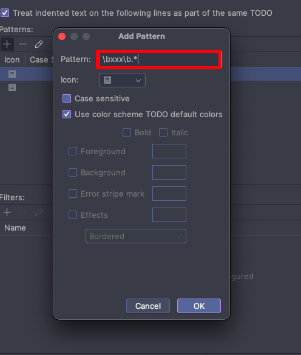

---
## 1) 주석 태그(Comment Tag)
---

```
💡 주석 태그(Comment Tag)**  
  
- 소스 코드나 문서에서 사용되는 특정 표시를 의미합니다. 해당 표시를 통해 개발자에게 작업 나중에 처리하거나 수정해야 함을 알리는 역할을 합니다.  
  
- 이러한 주석 태그를 사용하여 작업을 추적하고 개발자 및 팀원들과의 협업을 원활하게 할 수 있습니다.
```

## 2) 주석 태그(Comment Tag) 종류
---

```
💡 주석 태그(Comment Tag) 종류**  
  
- IntelliJ 내에서 최초 제공하는 주석 태그는 TODO, FIXME에 대해 지원하고 있고, 커스텀으로 나만의 주석 태그를 만들 수 있습니다.  
- HACK, XXX, BUG, DEBUG와 같은 경우는 커스텀 태그로 자주 사용되는 태그입니다.
```

|   |   |   |
|---|---|---|
|**주석 태그**|**설명**|**커스텀 주석 태그 여부**|
|**TODO**|앞으로 해야 할 일|X|
|**FIXME**|앞으로 수정되어야 할 일|X|
|**HACK**|추후 수정 되어야 할 일|O|
|**XXX**|다른 프로그래머에게 문제가 있고 잘못된 코드를 경고|O|
|**BUG, DEBUG**|버그가 발생한 위치|O|
|**NOTE**|추가 정보 또는 설명을 나타내는 주석|O|

### 1. TODO
---
```
💡 TODO**  
- ‘아직 해결되지 않은 작업이나 구현해야 할 부분’을 나타내는 주석 태그입니다.  
  
- 주석으로 TODO와 함께 어떤 작업이 필요한지 간단히 설명하고 나중에 찾기 쉽고도록 남겨둡니다. 이렇게 해두면 나중에 작업할 때 놓치지 않고 처리할 수 있습니다.
```

```
// TODO: 추후에 하드코딩을 개선해야 합니다.
```


### 2.FIXME
---
```
💡 FIXME 
- ‘수정이 필요한 버그, 오류, 또는 잘못된 동작’을 나타내는 주석 태그입니다.  
- FIXME 주석 태그를 포함하고 어떤 문제가 있는지 설명하고 이를 해결해야 하는 이유를 기록합니다.  
- 코드나 문서를 검토할 때 빠른 수정이 필요한 부분을 강조하는 데 사용됩니다.
```

```
// FIXME: 해당 코드에서는 런타임 오류가 발생합니다. 수정해야 합니다!
```


## 3.HACK
---
```
💡 HACK
- 워크어라운드라고 하며 '임시방편으로 동작하는 코드'에 대한 주석 태그를 의미합니다.
- FIXME 주석 태그와 비슷하지만 당장 수정이 아닌 추후에 정리할 필요가 있는가 있는 부분을 나타냅니다.
```

```
// HACK : 응급조치로 우선 하드코딩을 적용하였습니다.
```


## 4.XXX
---
```
💡 XXX
- ‘다른 개발자가 알아봐야 할 중요한 이슈 또는 경고’를 나타내는 주석 태그를 의미합니다.
- XXX와 함께 어떤 문제가 있는지 설명하고 이를 처리해야 하는 이유를 기록합니다. 
- 코드나 문서를 검토할 때 주의해야 할 부분을 강조하는 데 사용되며 주로 버그 또는 잠재적인 문제를 가리키는 데 사용되며 개선이 필요한 부분을 의미합니다.
```

```
// XXX: 해당 부분이 하드코딩 된 것 같습니다. 수정하셔야 될꺼 같아요
```


## 3) IntelliJ에서 태그 위치 확인방법
---


### 1. View 탭 - Tool Windows 탭 - TODO 메뉴를 선택해줍니다.
---


### 2. 아래와 같이 주석 태그를 사용한 부분을 확인이 가능합니다.
---


## 4) 커스텀 주석 태그 추가
---


### 1. 현재 상태 확인
---


### 2. Setting.. 버튼을 눌러줍니다.
---


### 3. Editor 탭 - TODO 탭 - 'todo' pattern을 선택하고 'Add' 버튼을 눌러줍니다.
---


### 4. 아래와 같이 XXX 태그를 추가해 줬습니다.

```
\\bxxx\\b.*
```




### 4. 변경확인
---

```
💡 변경 확인
- 일반 태그와 구분된 커스텀 태그를 사용할 수 있게 되었습니다
```


## 5) 주석 태그 색 구분하기 : Code Highlight
---


## 1. 현재 상태 확인
---
```
💡 현재 상태 확인
  
- 아래와 같이 TODO 태그는 보라색으로 되어있는데 FIXME와 동일한 색이기에 ‘노란색’으로 변경하여 구분합니다.
```


### 2. Settings.. 버튼을 눌러줍니다
---


### 3. Editor 탭 - TODO - 'todo' pattern을 선택하고 'Edit' 버튼을 눌러줍니다.
---


### 4. 'Use color scheme TODO default colors'를 해제합니다.
---


### 5. 해당부분을 수정해 줍니다.
---


### 6. 변경확인
---

