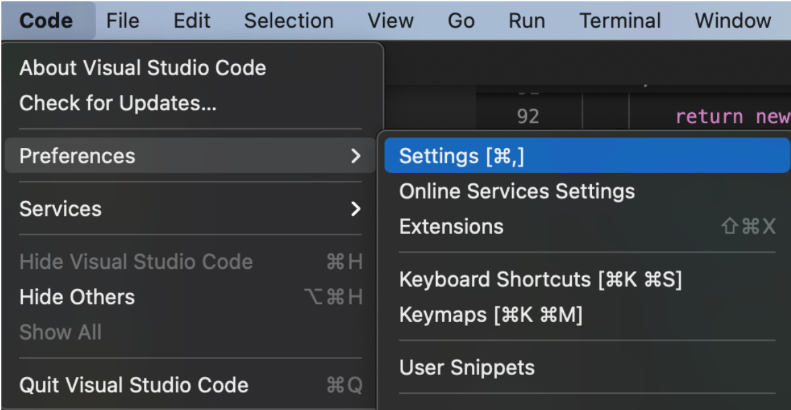
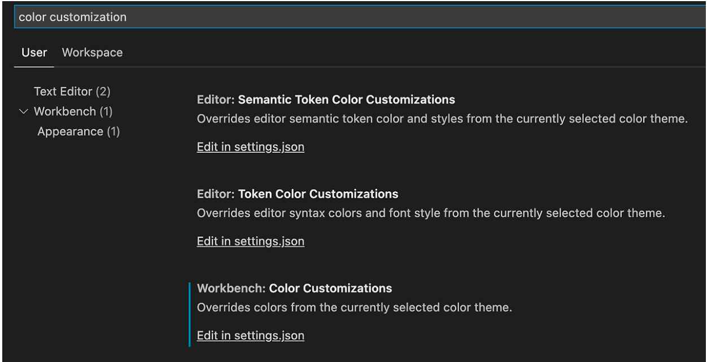
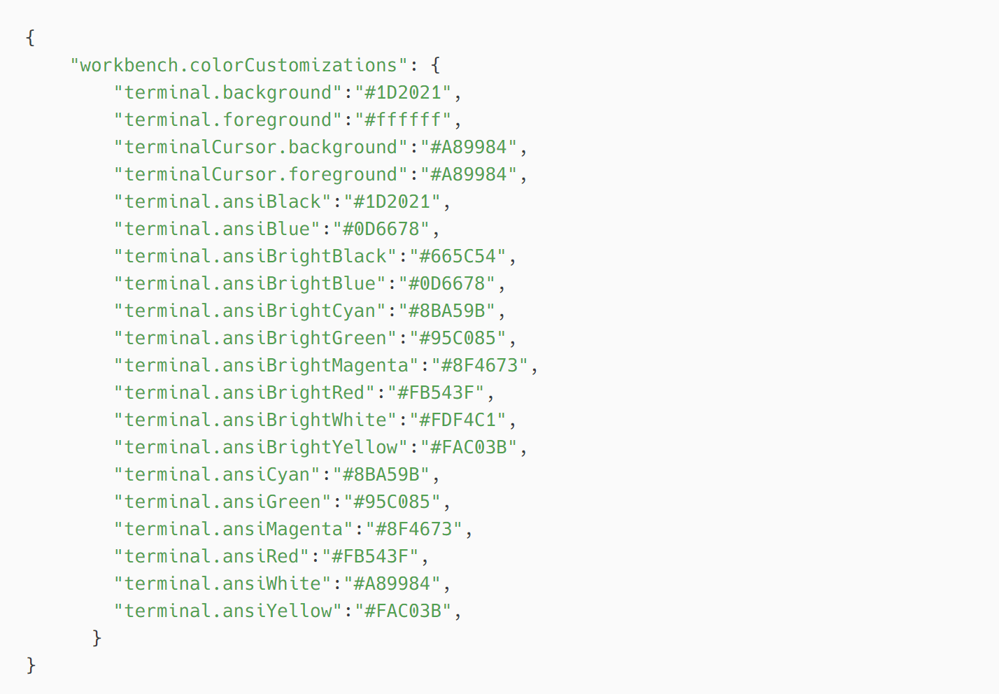
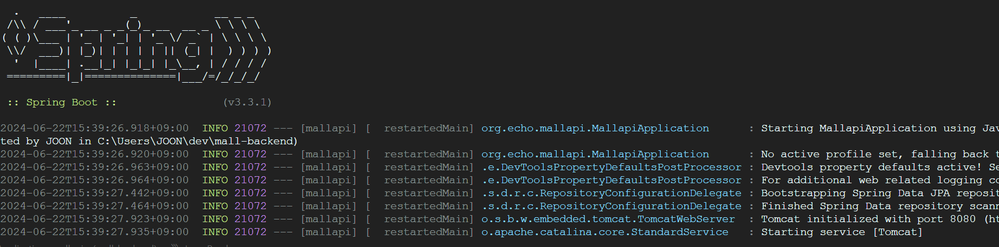

---

VSCode 로 Spring Boot 환경에서 로그 레벨별로 구분해서 볼 수 있게 컬러설정

## 1) VScode 터미널 색상 설정하기
---

### 1. Preferences -> Settings 



### 2. Color Customizations 검색 -> Edit in settings.json 클릭



### 3. 입력



## 2) Spring Boot 설정
---


- 진행중인 프로젝트의 application.properties 파일 열어서 입력

```
spring.out.put.ansi.enabled = always	
```


## 3) 결과
---



## 4) 참고
---

 [색상 조합 추천 사이트](https://glitchbone.github.io/vscode-base16-term/#/bright)

